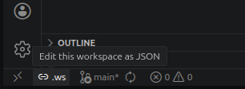

# WS Edit

A minimal VS Code extension for editing multi-folder workspaces.

When a saved workspace is open, a `.ws` button appears on the bottom left of the status bar:

Click it to open the workspace file in an editor tab — you can comment out folder entries to easily add / remove them from the workspace. VS Code applies the changes on save:

## License

MIT — see LICENSE file for details.
