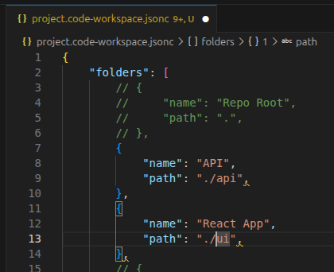

# WS Edit

A Visual Studio Code extension for editing workspace files directly in the editor.

Quickly add or remove folders from your workspace without losing track of which ones you use regularly.

## Features

- **Status Bar Integration**: A `WS` button appears in the status bar whenever you have a multi-folder workspace open
- **JSONC Editing**: Opens the workspace file in an editor tab with full syntax highlighting, comment toggling, and schema validation
- **Live Updates**: Commenting or uncommenting a folder entry (`Ctrl-/`) and saving the file immediately adds or removes it from the workspace

## Usage

When you are working with a multi-folder workspace that has been saved to disk, a `WS` button appears in the status bar.

Click it to open the workspace file in an editor. Comment out individual folder entries to temporarily exclude them from your workspace, then uncomment to bring them back. Changes take effect as soon as you hit save:

## Attribution

Developed by **Cyberclast Software Solutions Ltd.**

Website: [https://cyberclast.com](https://cyberclast.com)

## License

MIT License - See LICENSE file for details

## Support

For issues, feature requests, or contributions, please visit the [GitHub repository](https://github.com/cyberclast/ws-edit).
